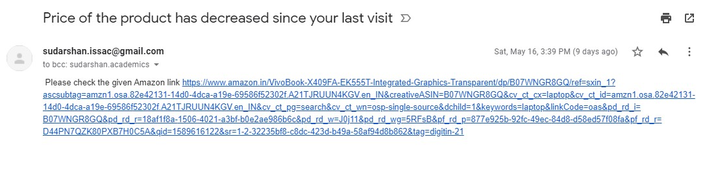

# Amazon-Price-Tracker

This simple python project helps you in keeping a track of the price of your favorite items on any any e-commerce (Amazon in our case). If you ever wanted to automate the process of daily checking the price of any item whether it dropped on certain days, this app serves this purpose. It not only keeps a track of the price but also alerts you via mail when the price falls below a certain predefined (by you) value. So you can quickly grab it before anyone else does! 

In this project i have taken the example of a sample item of Laptop price tracking from Amazon website as shown below:-

The script will instantaneously send a mail to your pre-assigned email address once the price of your desired item falls below a certain threshold price value as mentioned by you. So that you can immediately grab the item at your desired price.

Hope with this project brings you valuable insights about the various possibilities of Python Language. This project was implemented as a part of my web scraping learning session.
